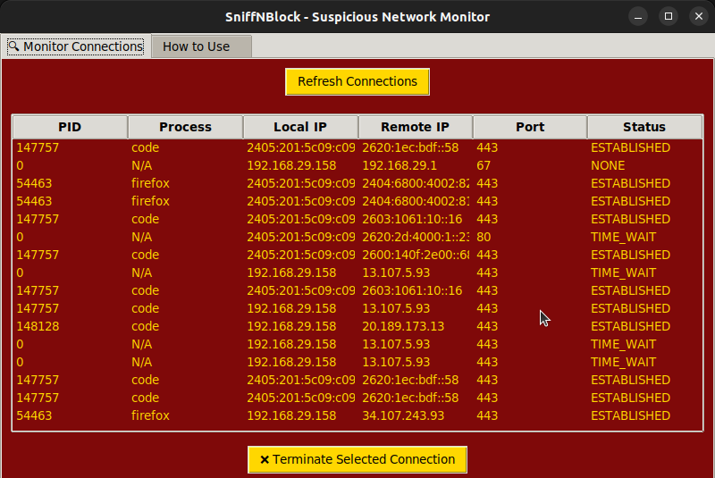

# 🛡️ SniffNBlock - Suspicious Network Monitor & Blocker

**Day 23 of #31ToolsIn31Days**

SniffNBlock is a Guardian-themed GUI tool that allows you to **monitor**, **inspect**, and **terminate** suspicious network connections on your machine.

## 🚀 Features

| Feature                           | Description                                                                 |
|----------------------------------|-----------------------------------------------------------------------------|
| 🔍 Monitor Active Connections    | View real-time TCP/UDP connections including local/remote IPs, ports, PIDs |
| 🔎 Process Name Lookup           | Automatically resolve which process owns each connection                    |
| 🧠 GUI Filtering & Interaction   | Select and terminate any suspicious process from a clean, colorful GUI     |
| 📖 How-To Tab                    | Built-in instructions and safety guidelines                                 |
| 🎨 Guardian Theme              | Red-Gold color scheme to honor protectors of the digital realm             |


## 🧠 Why Use SniffNBlock?

Attackers often exploit open ports or long-running processes to communicate with external Command & Control (C2) servers. This tool helps:

- 🕵️ Detect outbound connections to suspicious or foreign IPs
- 🔐 Spot strange apps phoning home
- ❌ Kill unauthorized or zombie processes before they escalate

---

## 🧪 Tech Stack

- `tkinter` – for GUI
- `psutil` – to gather network connections & process data
- `socket` – for IP & hostname utilities
- `threading` – to keep GUI responsive

---

## 📦 Installation

```bash
git clone https://github.com/yourusername/SniffNBlock.git
cd SniffNBlock
pip install -r requirements.txt
python3 main.py
```

## 📸 Screenshot


> 

> 
